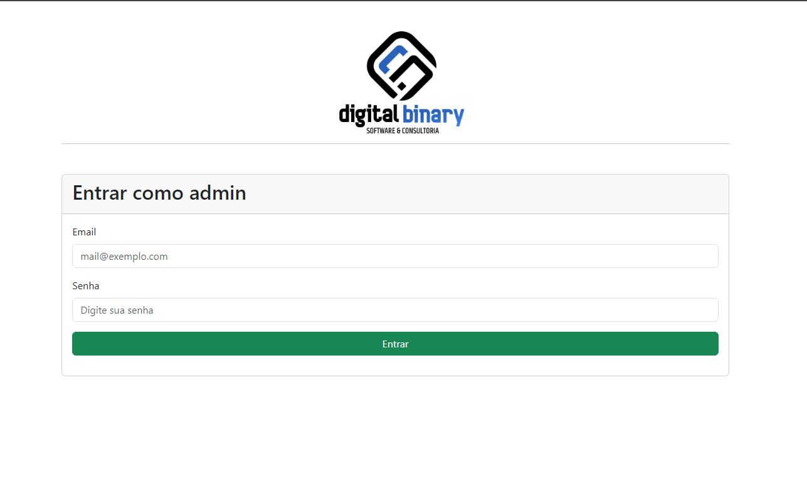
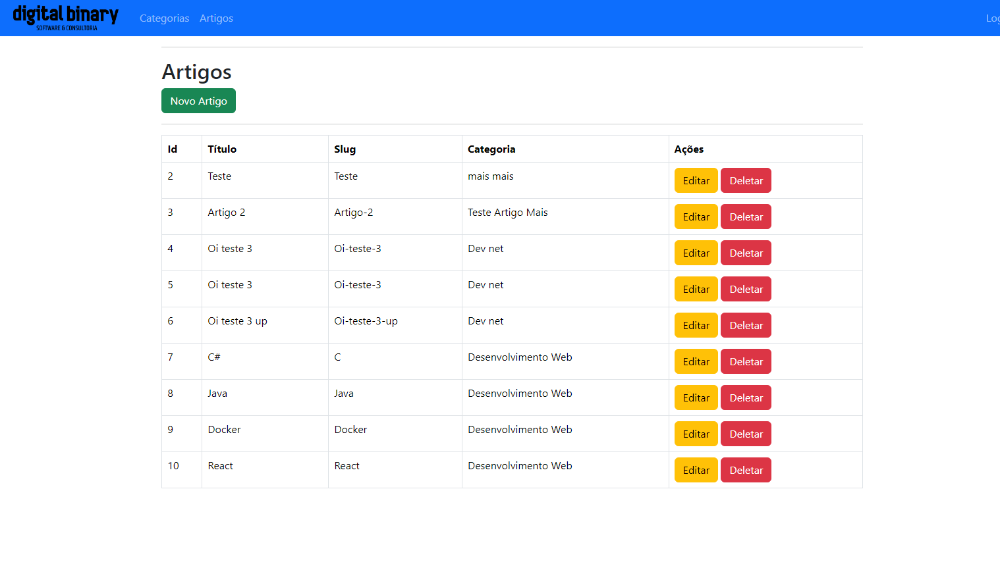
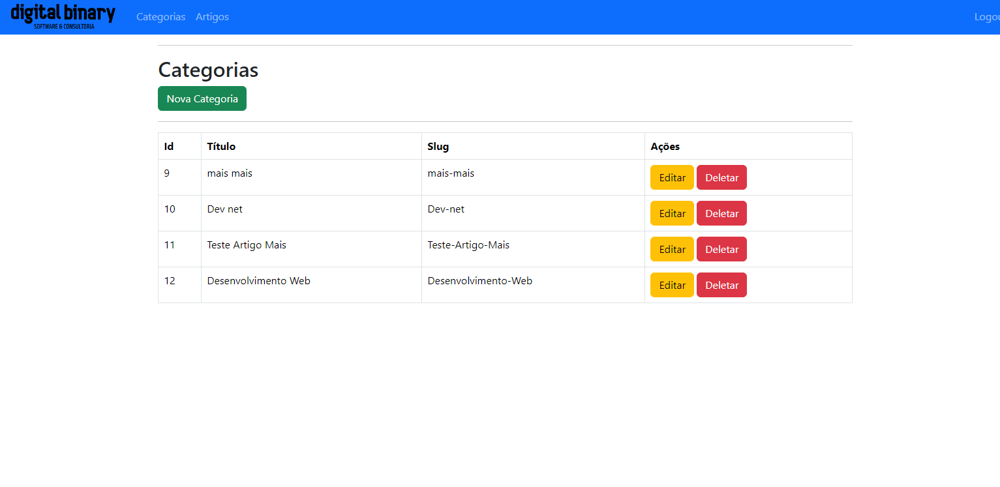
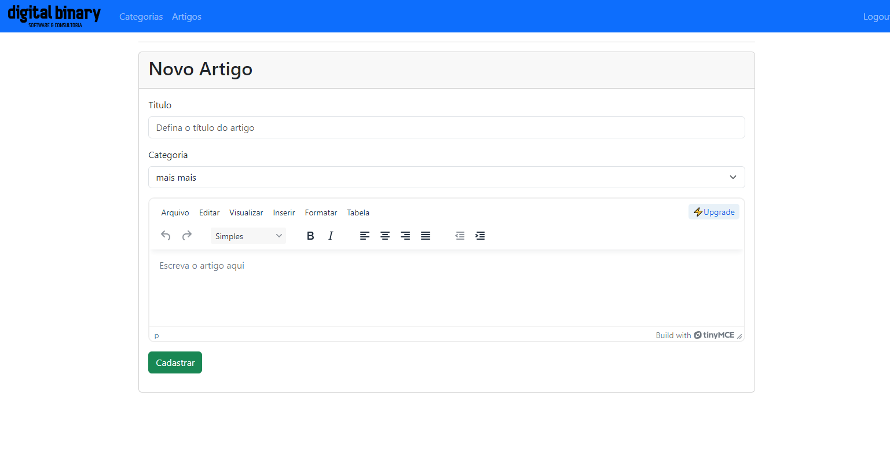
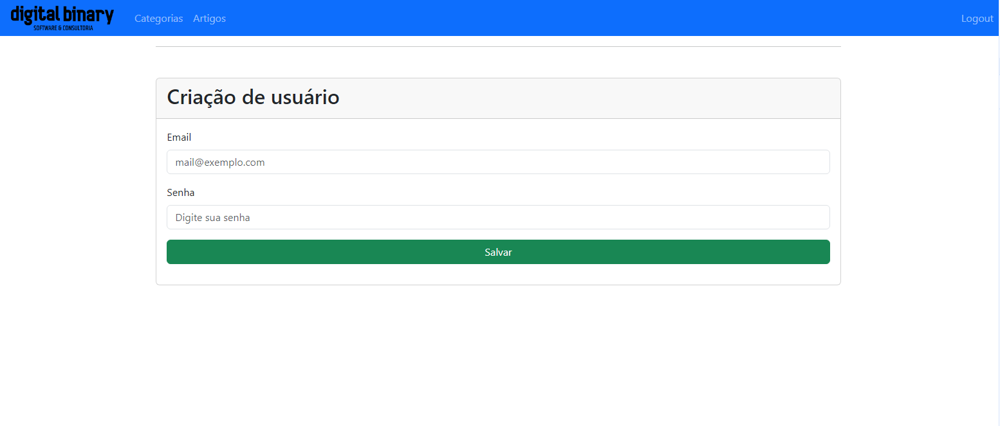
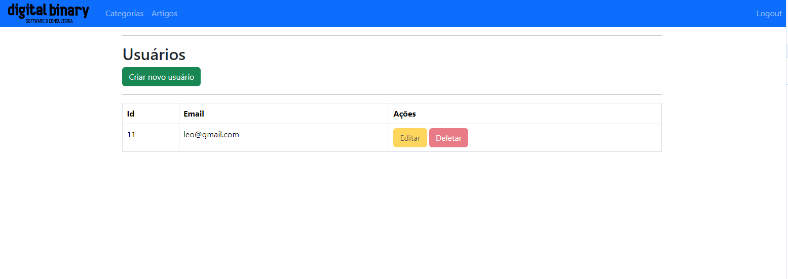

# blog-node
Criação de um blog utilizando Node e a engine de front end Ejs

Rotas (urls):
* Home: http://localhost:3000/
* Criar usuário: http://localhost:3000/admin/users/create
* Lista de usuários: http://localhost:3000/admin/users/


- Login


##

- Artigos


##

- Categorias


##

- Novo Artigo


##

- Novo usuário


##

- Listagem de usuários


## Prerequisites

✔ - Node 18.19.1

✔ - Mysql

## Quick Start

```
  - Na pasta database, ajustar as confdigurações do Sequelize conforme suas configurações do Mysql, e criar seu banco de dados conforme o nome na ocnfiguração:

  const connection = new Sequelize('guia-blog', 'root', 'root', {
      host: 'localhost',
      dialect: 'mysql',
      timezone: '-03:00'
  });
  
  - Rodar o comando para instalar as dependências na pasta principal do projeto: npm install

  - Rodar Projeto via nodemon com o comando nodemon index.js

  - Acessar a rota principal: http://localhost:3000/
  
```
